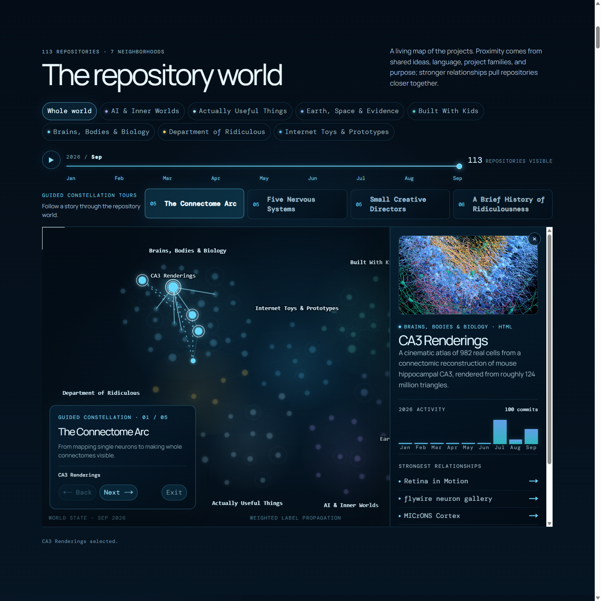
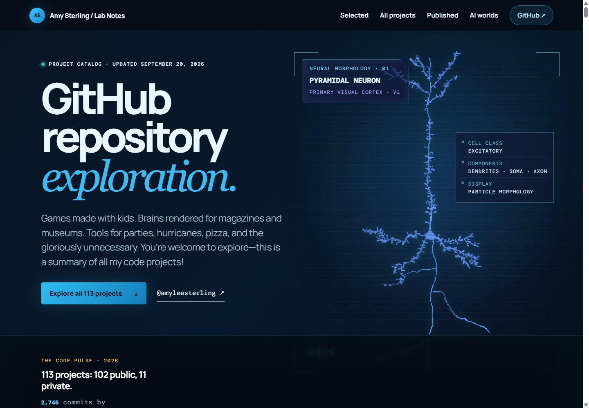
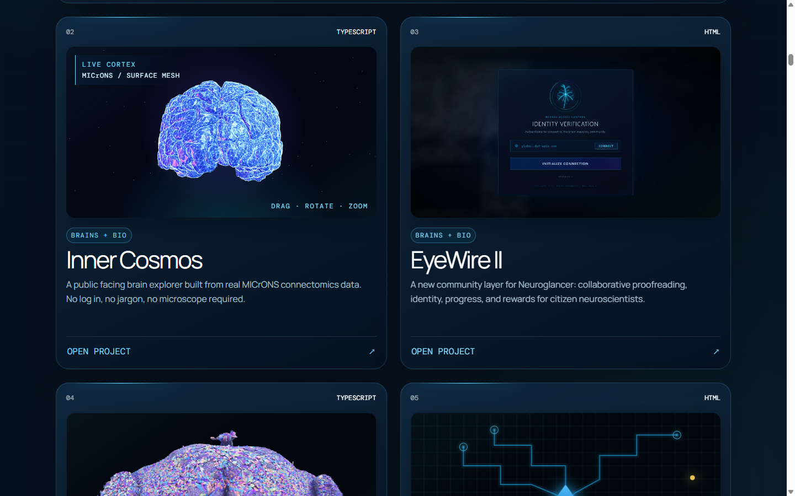
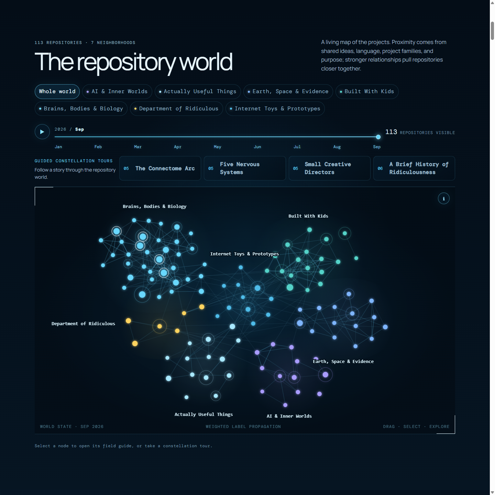

# Projects Overview

An interactive exhibition of Amy Sterling's GitHub repositories. The catalog contains 112 projects as of September 20, 2026, including forks, older projects, and private repository listings. Private code still requires GitHub access.

The site organizes projects into thematic rooms, highlights selected work with real project imagery, visualizes public commit activity, and maps the repositories as an explorable network of related ideas.

**Live site:** [amy-projects-2026.amysterling.chatgpt.site](https://amy-projects-2026.amysterling.chatgpt.site/)

## The repository world

[](https://amy-projects-2026.amysterling.chatgpt.site/#world)

The network graph turns the repository collection into seven explorable neighborhoods. Weighted relationships connect projects that share ideas, technologies, families, and purpose. Select a node for its field guide, scrub through the year, or follow a guided constellation tour.

## Visualization gallery

<p align="center">
  
  
</p>

<p align="center"><em>Interactive pyramidal-neuron particles · Inner Cosmos cortical surface mesh</em></p>

[](https://amy-projects-2026.amysterling.chatgpt.site/#world)

## Run locally

Requires [Node.js](https://nodejs.org/) 22.13 or newer.

```bash
git clone https://github.com/amyleesterling/projects-overview.git
cd projects-overview
npm install
npm run dev
```

Open the local URL printed in the terminal.

## Build

```bash
npm run build
```

The project uses React, TypeScript, Three.js, and [Vinext](https://github.com/cloudflare/vinext). The current production site is deployed through OpenAI Sites. Because this is a Vinext application rather than a static HTML bundle, publishing it on GitHub Pages would require a separate static-export adaptation.

## Project structure

- `app/data/catalog.json` contains the dated repository catalog and public contribution snapshot.
- `app/page.tsx` contains the categories, featured projects, and exhibition interface.
- `app/repository-world.tsx` implements the interactive repository graph, detail drawer, timeline, and guided constellation tours.
- `app/project-visual.tsx` generates repository-specific illustrations.
- `app/neuron-particle-banner.tsx` contains the interactive pyramidal-neuron visualization.
- `public/` contains featured imagery and sharing assets.

## Refresh Amy’s catalog

With the GitHub CLI installed and authenticated, run:

```bash
npm run refresh:catalog
npm test
```

The refresh reads all public repositories (including forks and older projects), refreshes metadata for private listings already in the catalog, and saves the snapshot only after every request succeeds. It never discovers new private projects or saves private contribution histories. Curated descriptions, titles, live links and paper links are preserved. Review new entries and assign them to a room in `categoryNames` in `app/page.tsx`; otherwise they appear under Internet Toys & Prototypes.

The September 20 snapshot contains 102 public repositories and 10 existing private listings. Its activity chart counts 2,270 public commits attributed to @amyleesterling by GitHub from January 1 through the capture time. This uses GitHub profile contribution rules, not all commits on all branches or commits by all collaborators. Automation is included when GitHub attributes it to this account. Historical counts can change as GitHub attribution or repository visibility changes. Private listings show their last-pushed date instead of a commit count.

The displayed project count, refresh date, metadata and timeline endpoint are derived from the snapshot. The current year must be reviewed before running the refresh in a new year.

The README screenshots show earlier captures of the exhibition; they are visual examples, not a current inventory.

## Use your own GitHub universe

The included importer can collect public repositories from any GitHub user or organization. It reads public GitHub metadata only; it never clones or executes the imported repositories.

```bash
# Your own account
npm run import:github -- YOUR_GITHUB_NAME

# Someone else's public repositories
npm run import:github -- karpathy
npm run import:github -- anthropics
```

By default it includes non-fork, non-archived repositories pushed during the current year and writes them to `imports/OWNER-YEAR.json`. Useful options:

```bash
npm run import:github -- karpathy -- --year=2025
npm run import:github -- anthropics -- --all-years
npm run import:github -- YOUR_GITHUB_NAME -- --include-forks --include-archived
npm run import:github -- YOUR_GITHUB_NAME -- --output=imports/my-projects.json
```

Unauthenticated GitHub API requests work for small catalogs. For larger accounts, provide a read-only token through the standard `GITHUB_TOKEN` environment variable to receive GitHub's higher API rate limit. Do not commit the token.

### Plug the import into the exhibition

1. Run the importer and review its generated JSON. Descriptions, homepages, languages, topics, stars, and last-pushed dates come directly from public GitHub metadata.
2. In `app/page.tsx`, import the generated file and replace the `catalog.repositories` assignment:

   ```tsx
   import catalog from "../imports/YOUR_GITHUB_NAME-2026.json";

   const repos: Repo[] = catalog.repositories;
   ```

3. Update `categoryNames` in `app/page.tsx` to arrange repository names into the seven neighborhoods. Names not assigned to a neighborhood automatically land in **Internet Toys & Prototypes**.
4. Choose highlights in `featuredNames`, and add real screenshots or image URLs to `featuredImages`.
5. Replace or clear the `commitPulse` assignment from Amy’s snapshot. The importer deliberately does not scrape commit histories because doing so requires many additional API requests.
6. Update the personal copy, publication list, social image, and site metadata, then run `npm run build`.

The importer output intentionally uses the exhibition's compact field names (`n`, `d`, `l`, `u`, `h`, `t`, and `f`), so the repository records can be used without a separate conversion step. The extra `topics` and `stars` fields are safe to leave in place.

Working snapshots generated with this importer are included in [`examples/karpathy-2026.json`](examples/karpathy-2026.json) and [`examples/anthropics-2026.json`](examples/anthropics-2026.json).

The deployed exhibition also includes complete interactive examples for [Anthropic](https://amy-projects-2026.amysterling.chatgpt.site/anthropics) and [OpenAI](https://amy-projects-2026.amysterling.chatgpt.site/openai). The OpenAI snapshot is stored in [`examples/openai-2026.json`](examples/openai-2026.json).
