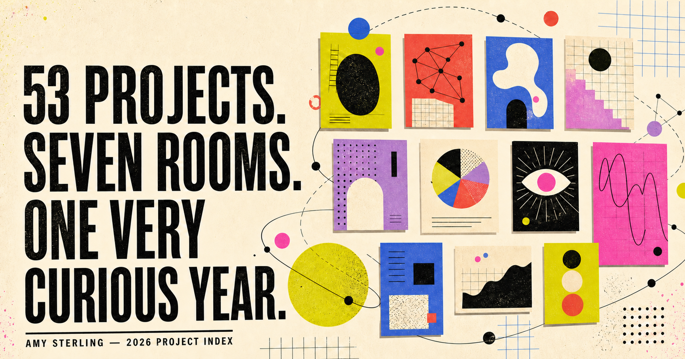

# Projects Overview

An interactive exhibition of Amy Sterling's public GitHub repositories touched in 2026.

The site organizes projects into thematic rooms, highlights selected work with real project imagery, visualizes public commit activity, and maps the repositories as an explorable network of related ideas.

**Live site:** [amy-projects-2026.amysterling.chatgpt.site](https://amy-projects-2026.amysterling.chatgpt.site/)



## Run locally

Requires [Node.js](https://nodejs.org/) 22.13 or newer.

```bash
git clone https://github.com/amyleesterling/projects-overview.git
cd projects-overview
npm install
npm run dev
```

Open the local URL printed in the terminal.

## Build

```bash
npm run build
```

The project uses React, TypeScript, Three.js, and [Vinext](https://github.com/cloudflare/vinext). The current production site is deployed through OpenAI Sites. Because this is a Vinext application rather than a static HTML bundle, publishing it on GitHub Pages would require a separate static-export adaptation.

## Project structure

- `app/page.tsx` contains the repository catalog, categories, featured projects, and activity data.
- `app/repository-world.tsx` implements the interactive repository graph, detail drawer, timeline, and guided constellation tours.
- `app/project-visual.tsx` generates repository-specific illustrations.
- `app/neuron-particle-banner.tsx` contains the interactive pyramidal-neuron visualization.
- `public/` contains featured imagery and sharing assets.

Repository information reflects public GitHub activity captured during 2026 and can be updated as new projects arrive.
