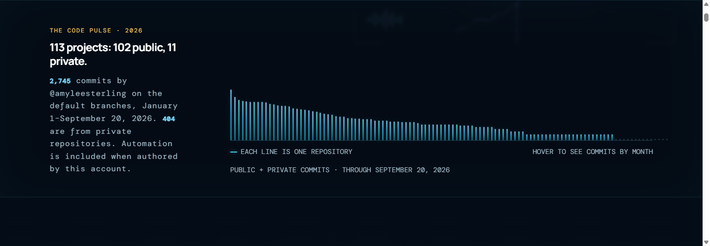
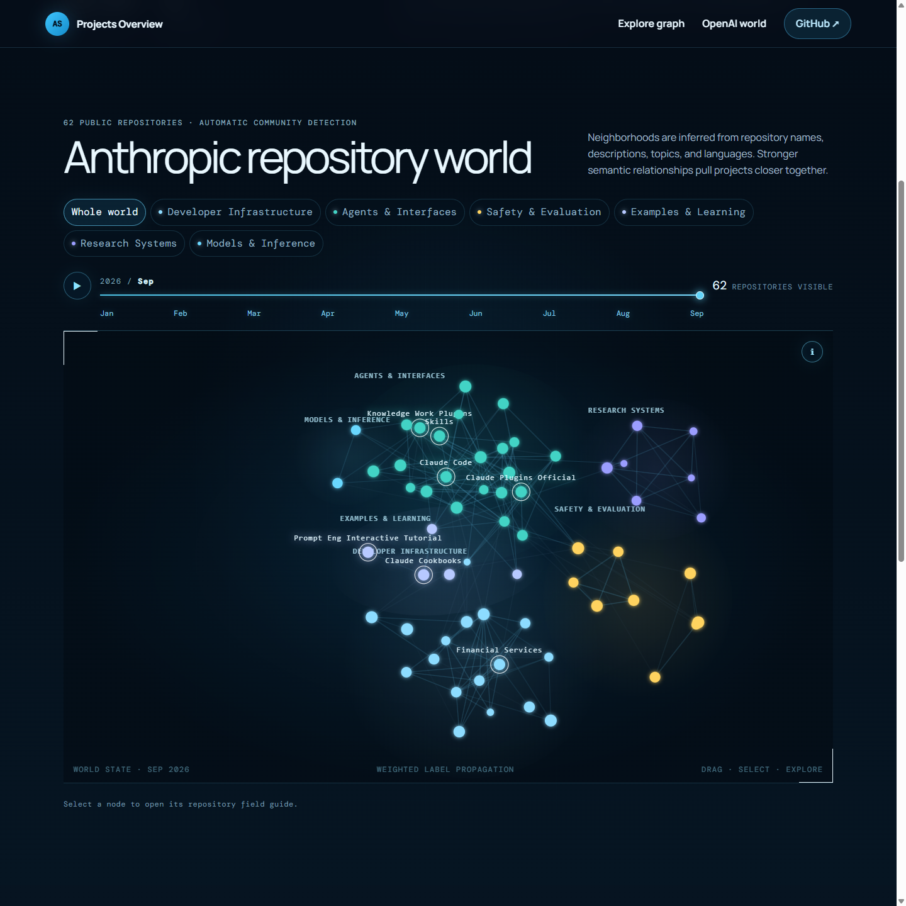
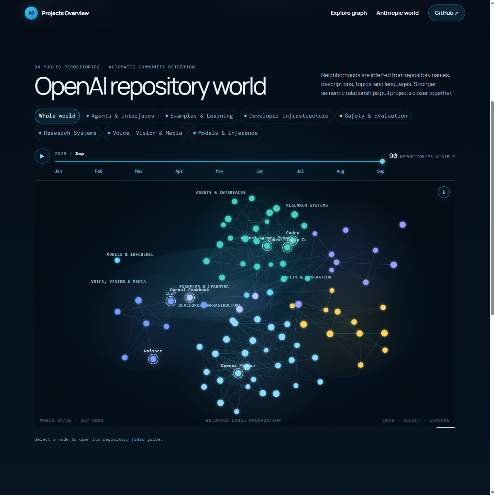

# Projects Overview

An interactive exhibition of Amy Sterling’s GitHub projects: neuroscience, games made with kids, creative tools, AI experiments, and beautifully unnecessary ideas.

**[Explore the live exhibition](https://amyleesterling.github.io/projects-overview/)** · **[Anthropic demo](https://amyleesterling.github.io/projects-overview/anthropics/)** · **[OpenAI demo](https://amyleesterling.github.io/projects-overview/openai/)**

The September 20, 2026 snapshot contains **113 projects**: 102 public repositories and 11 private repository listings. The activity chart includes **2,745 authored commits**, including 404 from private repositories. Private source code still requires GitHub access.

[](https://amyleesterling.github.io/projects-overview/)

## A world of connected projects

Seven thematic neighborhoods connect projects through shared ideas, technologies, and purpose. Drag nodes, select a repository for its field guide, scrub through the year, or follow a guided constellation tour.

[](https://amyleesterling.github.io/projects-overview/#world)

[](https://amyleesterling.github.io/projects-overview/#world)

## Activity and interactive science

The code pulse includes every repository in the catalog. Hover or focus a bar to see its monthly activity. Selected projects also include a rotating cortical surface mesh and an animated neuron game.

[](https://amyleesterling.github.io/projects-overview/)

[](https://amyleesterling.github.io/projects-overview/#featured)

## Anthropic and OpenAI demos

Both demos were refreshed on **September 20, 2026** from public GitHub metadata. They include non-fork, non-archived repositories pushed in 2026: **62 from Anthropic** and **90 from OpenAI**. Each page shows its snapshot date, total stars, languages, inferred neighborhoods, and repository details.

[](https://amyleesterling.github.io/projects-overview/anthropics/)

[](https://amyleesterling.github.io/projects-overview/openai/)

Node sizes reflect stars at capture time. The organization timelines filter by each repository’s **latest push month**; they do not represent commit histories or repository creation dates. These are independent examples built from public metadata, not official company sites.

All screenshots above were captured from the September 20 static export. Click an image to explore its live page.

## Run and build

Requires [Node.js](https://nodejs.org/) 22.13 or newer.

```bash
git clone https://github.com/amyleesterling/projects-overview.git
cd projects-overview
npm ci
npm run dev
```

Open `http://localhost:3000/projects-overview/`.

To build, validate, and preview the exact static files deployed to GitHub Pages:

```bash
npm test
npm start
```

Open `http://127.0.0.1:5190/projects-overview/`. The `PORT` environment variable changes the preview port. `npm run build` creates the `out/` directory without running tests.

## GitHub Pages deployment

The site uses React, TypeScript, Three.js, and [Next.js static export](https://nextjs.org/docs/app/guides/static-exports). All three routes are prerendered HTML with browser-side interactions; production needs no application server, database, or account token.

[`.github/workflows/pages.yml`](.github/workflows/pages.yml) builds and tests pull requests. Pushes to `main` also publish `out/` with the official GitHub Pages Actions. The repository’s **Settings → Pages → Source** is **GitHub Actions**.

The deployment lives below `/projects-overview/`. `app/site.ts` defines that base path, the public URL, and paths for images and the brain mesh; `next.config.ts` imports the same base path. Inter-page links use ordinary static navigation, including direct visits to `/anthropics/` and `/openai/`.

## Refresh the snapshots

Amy’s catalog uses the authenticated GitHub CLI:

```bash
gh auth login
npm run refresh:catalog
```

The refresh checks the signed-in owner, includes all owned public and private repositories, and writes only after every request succeeds. Curated titles, descriptions, live links, and paper links are preserved. Review new entries and assign them in `categoryNames` in `app/page.tsx`; unassigned projects appear under Internet Toys & Prototypes.

Activity counts commits authored by `@amyleesterling` on each repository’s default branch, grouped by **UTC committer month**, from January 1 through capture time. This applies equally to public and private repositories. It excludes other authors and unmerged branches; automation is included when authored by this account. This differs from GitHub’s profile contribution rules. See the [GitHub commits API](https://docs.github.com/en/rest/commits/commits#list-commits).

Only repository metadata and aggregate monthly totals are published. Commit messages, source files, diffs, and author email addresses are not stored in the snapshot.

Refresh both public organization demos with:

```bash
npm run refresh:demos
npm test
```

The demo refresh command explicitly targets 2026; review the year before reusing it in a new year. Commit the reviewed snapshots and push to `main` to publish. Live visitors never need GitHub credentials.

## Make another repository world

The public importer works with any GitHub user or organization:

```bash
npm run import:github -- karpathy
npm run import:github -- anthropics --year=2026
npm run import:github -- YOUR_GITHUB_NAME --all-years --include-forks --include-archived
npm run import:github -- YOUR_GITHUB_NAME --output=imports/my-projects.json
```

By default it includes non-fork, non-archived repositories pushed during the current year. For larger catalogs, set the standard `GITHUB_TOKEN` environment variable to increase the API rate limit; never commit it. The importer reads public metadata and never clones or executes imported repositories.

To add a demo, import the generated JSON in a new `app/NAME/page.tsx` and render `OrganizationOverview`, following [`app/anthropics/page.tsx`](app/anthropics/page.tsx). It infers neighborhoods from names, descriptions, topics, and languages. Amy’s curated exhibition and authored-commit snapshot remain independent.

Example catalogs: [Anthropic](examples/anthropics-2026.json), [OpenAI](examples/openai-2026.json), and [Karpathy](examples/karpathy-2026.json).

## Project structure

- `app/data/catalog.json` — Amy’s repository metadata and monthly commit totals.
- `app/page.tsx` — the exhibition, selected projects, search, and activity chart.
- `app/repository-world.tsx` — interactive graph, field guides, timeline, and tours.
- `app/organization-overview.tsx` — shared public-organization demo.
- `app/inner-cosmos-preview.tsx` — interactive cortical surface mesh.
- `app/project-visual.tsx` — repository-specific illustrations.
- `examples/` — public demo snapshots.
- `public/` — images, mesh, and current README screenshots.
- `tests/rendered-html.test.mjs` — exported route, asset path, and snapshot integrity checks.
